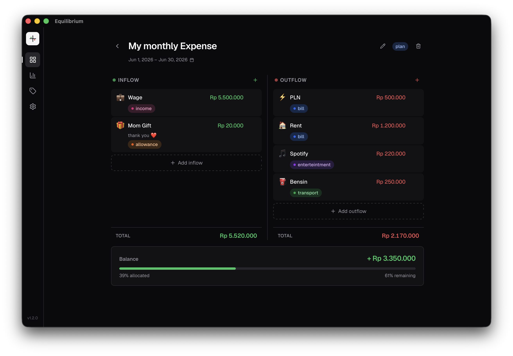

<p align="center">
  
</p>

<h1 align="center">Equilibrium</h1>

<p align="center">
  A privacy-first budgeting app for your desktop. No accounts, no cloud — your data lives as a SQLite file on your machine.
</p>

<p align="center">
  
  
  
</p>

---

## Features

- **Monthly budgets** — plan spending, track inflows and outflows
- **Tags** — flexible, color-coded labels reusable across budgets
- **Spending stats** — summary tiles and charts segmented by budget lifecycle
- **Dark mode** — built in, no toggle hunting
- **100% offline** — no network, no accounts, no telemetry

---

## Download

Get the latest release from the [Releases page](https://github.com/chawza/Equilibrium/releases).

| Platform | Bundle |
|---|---|
| macOS (Apple Silicon) | `.dmg` / `.app` |
| Windows | `.msi` / `.exe` |
| Linux | `.AppImage` / `.deb` |

---

## Install / First Launch (Unsigned Build)

This app ships **unsigned** — code signing and notarization are not configured for this release (Apple Developer Program costs $99/yr; Windows EV certs $400+/yr). Your OS will show a one-time security warning on first launch. This is expected.

### macOS
1. download the `.dmg` file from [releases page](https://github.com/chawza/Equilibrium/releases)
2. click the file and install it (swipe to Application)
3. run the following command (REQUIRED!) in terminal
    ```bash
    xattr -dr com.apple.quarantine /Applications/Equilibrium.app
    ```
    > Mac OS will prevent the app startup because of the unsigned app

### Windows

1. Run the `.msi` or `.exe` installer.
2. When SmartScreen appears, click **More info** → **Run anyway**.

After the one-time prompt, the app installs and launches normally.

### Linux

```bash
# AppImage — make executable and run
chmod +x Equilibrium_*.AppImage
./Equilibrium_*.AppImage

# .deb — install via dpkg
sudo dpkg -i equilibrium_*.deb
```

---

## Building from Source

**Requirements:** Rust (stable), Node.js 20+, platform WebView dependencies.

```bash
# Install frontend dependencies
npm ci

# Development (hot-reload)
npm run tauri dev

# Production build
npm run tauri build
```

Linux also requires: `libwebkit2gtk-4.1-dev libappindicator3-dev librsvg2-dev patchelf`

---

## License

MIT
